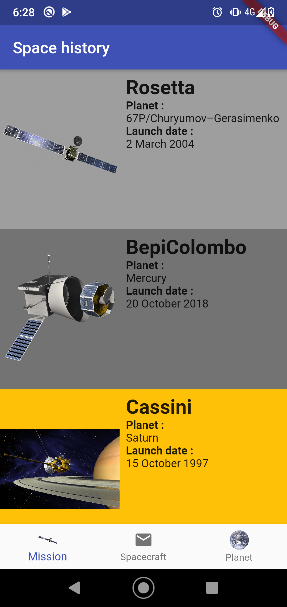

# alexandrespace

Space history

### A flutter app to explore space exploration.

Disclaimer : This data set is used for education purpose only, it may be inaccurate.

### The purpose of this project is to showcase flutter application.

Image credit : ESA/NASA